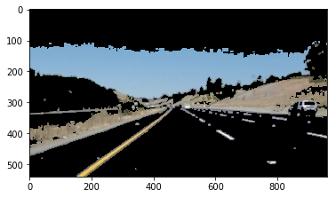

# **Finding Lane Lines on the Road: Writeup** 

**Finding Lane Lines on the Road**

The goals / steps of this project are the following:
* Make a pipeline that finds lane lines on the road
* Reflect on your work in a written report

---

Please see notebook_final.html for a pre-run version of my notebook (though if you re-run the pipeline the videos displayed will change). P1_2.ipynb is the notebook in which I developed my pipeline.

### Reflection

### 1. Describe your pipeline. As part of the description, explain how you modified the draw_lines() function.

I used a different naming convention than `draw_lines`. In my notebook, the function `findLaneLinesInImage` contains the image processing pipeline.

Here is a demo image that I will use to demonstrate the various stages of my pipeline:

The steps in my pipeline are:

1. Gaussian blur using a 3x3 kernel

    

2. Identify yellow/white regions in the image using thresholds identified in the HSV space.

    

3. Find edges in the image using Canny edge detection (on the image converted to greyscale), and filter out any edges that are not within the yellow/white regions.

    

4. Find the lines using this edge information by:
    1. starting at the center column in the image
    2. walking from the maximum row to a defined fraction of the rows
    3. at each row, scan left and right for edges that are spaced by the expected lane width at that row and are within the predefined ROI
    4. if a lane is found, record the start and end position, in addition to the width. The condition for finding a line is based on the width, whether or not this width is likely a lane line given the row (I compiled a set of data describing the lane width by row in an Excel spreadsheet - next time I plan to use python to analyse the data - from the collected data I fit a line that mapped row number to lane line width for the test videos and challenge video)
    5. Each time the row is decremented, adjust the 'center point' based on the previous line's center point if both lines were present in that row - the point of this was to enable curved roads to be detectable.
5. Perform a 2nd order polynomial regression on the left and right lane data (the polynomial maps a row to a column that is the inside of that line in the image)
6. Fill the area between the polynomials, half with green (to represent the left half of the lane) and half with red (to represent the right half of the lane).

    

### 2. Identify potential shortcomings with your current pipeline

The current pipeline will not work if the predefined ROI does not contain the lanes adjacent to the vehicle at least to some extent. In addition, the pipeline is dependent on strong edge detection and colour filtering. This system breaks down on the challenge video. 

### 3. Suggest possible improvements to your pipeline

A possible improvement would be to avoid using an ROI by simply picking up all lanes, then performing some operation that yields the possible lanes from all these 'samples' of the lane line locations. For this to work, the classification of edges into lane lines will need to be improved.

Another potential improvement is improvement of the edge detection - the current implementation works fine on the two test videos and all the text images, but the edge detection doesn't work well in the challenge clip. It seems to me that some sort of dynamic thresholding might be needed. Perhaps it is possible to adjust the bright portions of the image such that their contrast is improved - this would require some sort of segmentation of the image by brightness, followed by an adjustment of each of these segments such that the full range of colour is used to represent them.

I experimented with Hough lines as part of the pipeline but decided against using them. I was hoping to capture the locations of the lane lines in the image with the greatest possible accuracy, and I thought that by approximating the curves with straight lines the accuracy of the resultant lane line would be reduced. I believe that hough lines could be added back in as another source of information about the lane lines, and combined with the existing approach to produce a more robust solution. However my existing pipeline meets the requirements of the project, so I will leave this task to future work.

I noticed that the polynomial fit to the detected lane lines is poor farther out - I believe that this is because there are fewer pixels that represent this portion of the lane line, so the regression does not apporixmate the curvature in this region as well. Perhaps a transformation or weighting can be applied to improve the fit farther out.

Finally, I could use lane tracking to filter out noise and produce smoother lane lines.

### 4. Other notes

I think ultimately a data driven approach is the way to go for a problem like this, rather than manually tuning and observing changes in test videos manually. The reason being that, if I was to adjust the algorithm to match these two scenarios, there is almost certainly a large number of other situations in which the new algorithm would still fail. I would prefer to spend my time pursuing a more generic and efficient approach rather than manually tuning.